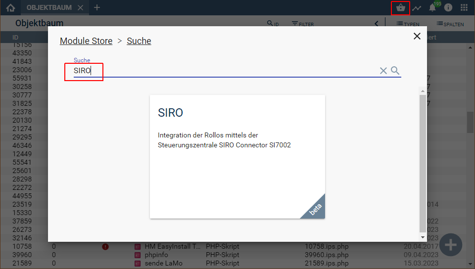

  

   

  

# SIRO Smart Rollos <!-- omit in toc -->  

Integration des xxx Gateway von Fa. Siro

## Dokumentation <!-- omit in toc -->

**Inhaltsverzeichnis**
- [1. Funktionsumfang](#1-funktionsumfang)
- [3. Software-Installation](#3-software-installation)
- [4. Einrichten der Instanzen in IP-Symcon](#4-einrichten-der-instanzen-in-ip-symcon)
- [5. Anhang](#5-anhang)
	- [1. GUID der Module](#1-guid-der-module)
	- [2. Changelog](#2-changelog)
- [6. Spenden](#6-spenden)
- [7. Lizenz](#7-lizenz)

## 1. Funktionsumfang

Folgende Module beinhaltet das SIRO Smart Rollos Repository:

- __SIRO Splitter__ ([Dokumentation](SIRO%20Splitter))  
	Splitter Instanz zwischen Geräte-Instanzen und IO-Instanz.  

- __SIRO Configurator__ ([Dokumentation](SIRO%20Configurator))  
	Konfigurator Instanz zum auslesen der bekannten Geräte und einfachen anlegen von Instanzen in Symcon.  

- __SIRO Roller Blind__ ([Dokumentation](SIRO%20Roller%20blind))  
	Geräte Instanz für die Steuerung eines Rollo.  

	## 2. Voraussetzungen  

 * Symcon ab Version 7.0  
 * Steuerungszentrale SIRO Connector SI7002  
 * Kabel mit RJ10 Stecker (4P4C) zum Anschluss an ein
 * RS485 Interface an USB/Seriell/Lan  
 * Handbuch des SI7002 mit Belegung der RJ10 Buchse

  
## 3. Software-Installation

  Über den 'Module-Store' in IPS das Modul 'SIRO' hinzufügen.  
   **Bei kommerzieller Nutzung (z.B. als Errichter oder Integrator) wenden Sie sich bitte an den Autor.**  
  

## 4. Einrichten der Instanzen in IP-Symcon

Nach der installation des Modules, muss eine Instanz des [Configurator-Moduls](SIRO%20Configurator/README.md) angelegt werden.  
Dadurch wird automatisch der benötigte [Splitter](SIRO%20Splitter/README.md) erstellt, sowie eine serielle IO-Instanz.  

Die IO-Instanz kann bei bedarf gegen z.B. einen ClientSocket ausgetauscht werden, wenn ein LAN/RS485 Wandler zum einsatz kommt.  

## 5. Anhang

### 1. GUID der Module

|       Modul       |     Typ      |                  GUID                  |
| :---------------: | :----------: | :------------------------------------: |
| SIRO Roller blind |    Device    | {742F943E-F3E2-0E3E-8F3D-9ACDDC379D26} |
|   SIRO Splitter   |   Splitter   | {BC63861A-BEA5-9F77-FC6D-977665E8D839} |
| SIRO Konfigurator | Configurator | {6C11D868-D4A8-501D-ED21-676F59B4A740} |

### 2. Changelog

Version 1.0:  

## 6. Spenden  
  
  Die Library ist für die nicht kommerzielle Nutzung kostenlos, Schenkungen als Unterstützung für den Autor werden hier akzeptiert:  

## 7. Lizenz

  [CC BY-NC-SA 4.0](https://creativecommons.org/licenses/by-nc-sa/4.0/)  
