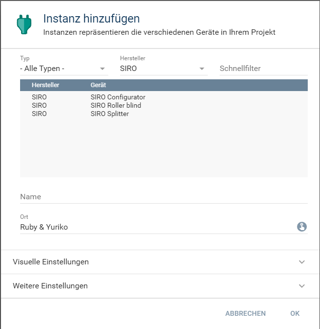
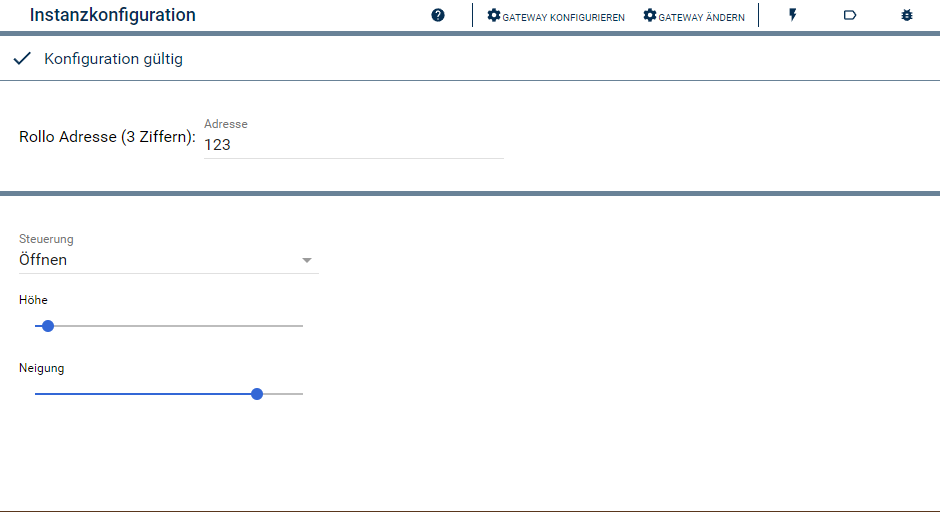

  

   

  

# SIRO Roller blind <!-- omit in toc -->
Beschreibung des Moduls.

## Inhaltsverzeichnis <!-- omit in toc -->

- [1. Funktionsumfang](#1-funktionsumfang)
- [2. Voraussetzungen](#2-voraussetzungen)
- [3. Software-Installation](#3-software-installation)
- [4. Einrichten der Instanzen in IP-Symcon](#4-einrichten-der-instanzen-in-ip-symcon)
- [5. Statusvariablen und Profile](#5-statusvariablen-und-profile)
  - [Statusvariablen](#statusvariablen)
  - [Profile](#profile)
- [6. WebFront](#6-webfront)
- [7. PHP-Befehlsreferenz](#7-php-befehlsreferenz)
- [8. Changelog](#8-changelog)
- [9. Spenden](#9-spenden)
- [10. Lizenz](#10-lizenz)

## 1. Funktionsumfang

* Steuerung eines Rollo aus Symcon
* Anzeigen der Zustände einen Rollo in Symcon

## 2. Voraussetzungen

- IP-Symcon ab Version 6.1

## 3. Software-Installation

 Dieses Modul ist Bestandteil der [SIRO-Library](../README.md#3-software-installation).    

## 4. Einrichten der Instanzen in IP-Symcon

 Unter 'Instanz hinzufügen' kann das 'SIRO Roller blind'-Modul mithilfe des Schnellfilters gefunden werden.  
	- Weitere Informationen zum Hinzufügen von Instanzen in der [Dokumentation der Instanzen](https://www.symcon.de/service/dokumentation/konzepte/instanzen/#Instanz_hinzufügen)

Es wird empfohlen diese Instanz über die dazugehörige Instanz des [Configurator-Moduls](../SIRO%20Configurator/README.md) anzulegen.  

 

__Konfigurationsseite__:

| Name    | Typ    | Standardwert | Beschreibung      |
| ------- | ------ | :----------: | ----------------- |
| Address | string |      0       | Adresse des Rollo |

 

## 5. Statusvariablen und Profile

Die Statusvariablen/Kategorien werden automatisch angelegt. Das Löschen einzelner kann zu Fehlfunktionen führen.

### Statusvariablen

| Name      | Typ     | Profil           | Beschreibung       |
| --------- | ------- | ---------------- | ------------------ |
| Steuerung | Integer | ~ShutterMoveStop | Manuelle Steuerung |
| Höhe      | Integer | ~Shutter         | Behanghöhe in %    |
| Neigung   | Integer | SIRO.Tilt        | Neigung in %       |
| Spannung  | Float   | ~Volt            | Motor Spannung     |

### Profile

| Name      | Typ     |
| --------- | ------- |
| SIRO.Tilt | Integer |

## 6. WebFront

....

## 7. PHP-Befehlsreferenz

`boolean SIRO_RequestState(integer $InstanzID);`
Erklärung der Funktion.

Beispiel:
`SIRO_RequestState(12345);`

---
`boolean SIRO_Open(integer $InstanzID);`
Erklärung der Funktion.

Beispiel:
`SIRO_Open(12345);`

---
`boolean SIRO_Close(integer $InstanzID);`
Erklärung der Funktion.

Beispiel:
`SIRO_Close(12345);`

---
`boolean SIRO_Stop(integer $InstanzID);`
Erklärung der Funktion.

Beispiel:
`SIRO_Stop(12345);`

---
`boolean SIRO_Move(integer $InstanzID, int $Value);`
Erklärung der Funktion.

Beispiel:
`SIRO_Move(12345, int $Value);`

---
`boolean SIRO_Tilt(integer $InstanzID, int $Value);`
Erklärung der Funktion.

Beispiel:
`SIRO_Tilt(12345, int $Value));`

---
`boolean SIRO_MoveTilt(integer $InstanzID, int $Level, int $Tilt);`
Erklärung der Funktion.

Beispiel:
`SIRO_MoveTilt(12345, int $Level, int $Tilt);`

## 8. Changelog

siehe Changelog der [SIRO-Library](../README.md#2-changelog).   

## 9. Spenden  
  
  Die Library ist für die nicht kommerzielle Nutzung kostenlos, Schenkungen als Unterstützung für den Autor werden hier akzeptiert:  

## 10. Lizenz

  [CC BY-NC-SA 4.0](https://creativecommons.org/licenses/by-nc-sa/4.0/)  
